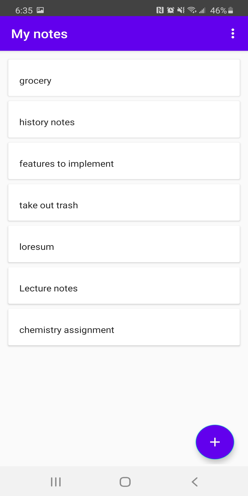
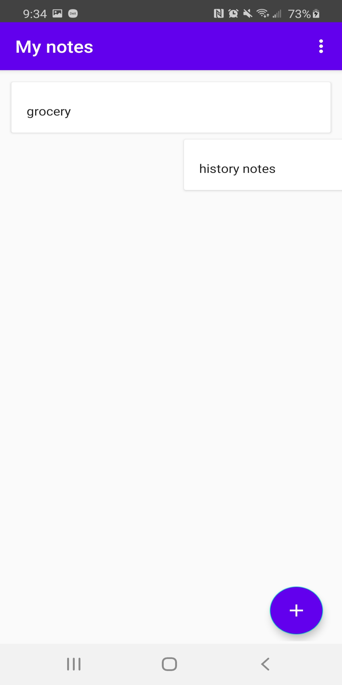
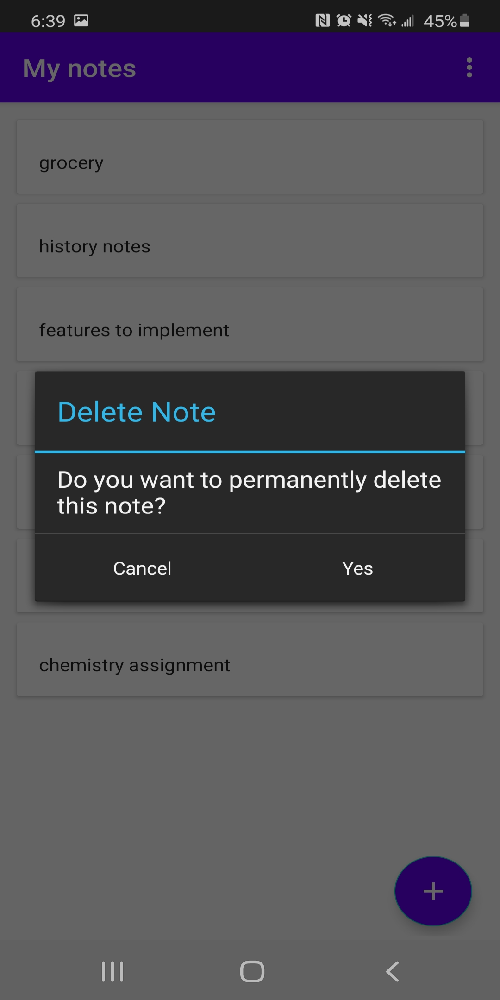

This is a basic notes app. You can add, delete or update your notes. I have added some features such as swipe to delete and the option to delete all your notes

https://play.google.com/store/apps/details?id=com.ismail.mynotes

# See all your notes

# Add a new note

# Update your note

# Swipe to delete your notes

# Delete your note

# Delete all your notes

